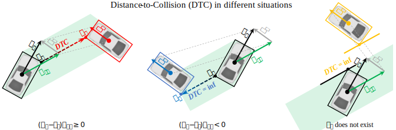

# Two-Dimensional-Time-To-Collision
This repository was initiated in 2022 Oct. to allow for fast computation of two-dimensional Time-To-Collision (2D-TTC), and updated in 2023 Mar. as well as 2024 May. For a more diverse comparison, In 2025 Feb., new surrogate safety measures, i.e., Deceleration Rate to Avoid Collision (DRAC) and Modified Time-To-Collision (MTTC), are added following the same computation logic.

These indicators are particularly useful for benchmarking and evaluating the collision risk in urban traffic (e.g., at intersections), but for sure can also be used in the scenario of longitudinal highway traffic. 

A document explaining my computation is provided [here](A_fast_calculation_of_2DTTC.pdf), where the core idea is $`TTC=\frac{DTC}{\|\boldsymbol{v}_{ij}\|}`$ and $DTC$ means a distance to collision, as shown in the figure below. This enables parallel computation with matrix operations, thus significantly improving computing efficiency for large-scale samples. Following the same logic, $DRAC=\frac{\|\boldsymbol{v}_{ij}\|^2}{2DTC}$; $MTTC=\frac{-\|\boldsymbol{v}_{ij}\|\pm\sqrt{\|\boldsymbol{v}_{ij}\|^2+2(\boldsymbol{a}_i-\boldsymbol{a}_j)DTC}}{\boldsymbol{a}_i-\boldsymbol{a}_j}$ and are further filtered according to [Ozbay et al. (2008)](https://doi.org/10.3141/2083-12). 

<p align="center">
  
</p>

__Note__ that this method follows the classic definition of TTC assuming constant velocity at the time moment of evaluation (a reference can be found [here](https://www.ictct.net/wp-content/uploads/SMoS_Library/LIB_Tarko_2018.pdf)). This clearly differs from alternative definitions such as the 2D-TTC by [Guo et al. (2023)](https://doi.org/10.1016/j.aap.2023.107063) or Time Advantage (TAdv, [Laureshyn et al., 2010](https://doi.org/10.1016/j.aap.2010.03.021)). Due to the drawback of the constant-velocity assumption, this method may not suit well for slow and conscious interactions.

If you use this software in your work, please kindly cite it using the following metadata:
```latex
@software{jiao2023ttc,
author = {Jiao, Yiru},
month = mar,
title = {{A fast calculation of two-dimensional Time-to-Collision}},
url = {https://github.com/Yiru-Jiao/Two-Dimensional-Time-To-Collision},
year = {2023}
}
```

## Libarary requirements
Any versions of `pandas` and `numpy`.

## Usage
The folder `src` includes two scripts, of which `TwoDimTTC` computes TTC only and `TwoDimSSM` computes TTC, DRAC, and MTTC. You may use the following example for computation.

````python   
import sys
sys.path.append('') # add the path where you save `TwoDimTTC.py` file
import TwoDimTTC

# To return a dataframe with the input vehicle pair samples, where 2D-TTC are saved in a new column named 'TTC'
samples = TwoDimTTC.TTC(samples, 'dataframe')

# To return a numpy array of 2D-TTC values
ttc = TwoDimTTC.TTC(samples, 'values')
````

````python   
import sys
sys.path.append('') # add the path where you save `TwoDimSSM.py` file
import TwoDimSSM

# To return a dataframe with the input vehicle pair samples, where the indicators are saved in new columns
samples = TwoDimSSM.TTC(samples, 'dataframe')
samples = TwoDimSSM.DRAC(samples, 'dataframe')
samples = TwoDimSSM.MTTC(samples, 'dataframe')
# or compute all indicators at once
samples = TwoDimSSM.TTC_DRAC_MTTC(samples, 'dataframe')

# To return a numpy array of the indicator values, change `dataframe` to `values`
indicator_func = TwoDimSSM.TTC # or TwoDimSSM.DRAC or TwoDimSSM.MTTC or TwoDimSSM.TTC_DRAC_MTTC
indicator = indicator_func(samples, 'values')
````


## Input
The first input is a pandas dataframe of vehicle pair samples, which should include the following columns. Note that the heading direction of a vehicle is not necessarily the direction of its velocity, especially when the vehicle is stopping or steering. The heading (hx, hy) is normalized to a unit vector in this function.
- `x_i`      :  x coordinate of the ego vehicle $i$ (usually assumed to be centroid)
- `y_i`      :  y coordinate of the ego vehicle $i$ (usually assumed to be centroid)
- `vx_i`     :  x coordinate of the velocity of the ego vehicle $i$
- `vy_i`     :  y coordinate of the velocity of the ego vehicle $i$
- `hx_i`     :  x coordinate of the heading direction of the ego vehicle $i$
- `hy_i`     :  y coordinate of the heading direction of the ego vehicle $i$
- `acc_i`    :  acceleration along the heading direction of the ego vehicle $i$ (only required if computing MTTC)
- `length_i` :  length of the ego vehicle $i$
- `width_i`  :  width of the ego vehicle $i$
- `x_j`      :  x coordinate of another vehicle $j$ (usually assumed to be centroid)
- `y_j`      :  y coordinate of another vehicle $j$ (usually assumed to be centroid)
- `vx_j`     :  x coordinate of the velocity of another vehicle $j$
- `vy_j`     :  y coordinate of the velocity of another vehicle $j$
- `hx_j`     :  x coordinate of the heading direction of another vehicle $j$
- `hy_j`     :  y coordinate of the heading direction of another vehicle $j$
- `acc_j`    :  acceleration along the heading direction of another vehicle $j$ (optional)
- `length_j` :  length of another vehicle $j$
- `width_j`  :  width of another vehicle $j$

The second input allows outputing a dataframe with inputed samples plus a new column named 'TTC', or mere TTC values.

## Output
The ego vehicle $i$ and another vehicle $j$ will never collide if they keep current speed when 
  - indicator==np.inf when indicator==TTC or indicator==MTTC, or
  - indicator==0 when indicator==DRAC.

A negative indicator value means the boxes of the ego vehicle $i$ and another vehicle $j$ are overlapping. This is due to approximating the space occupied by a vehicle with a rectangular. In other words, `indicator<0` in this computation means the collision between the two vehicles almost (or although seldom, already) occurred.

Note that the computation can return extreme small positive values (for TTC/MTTC) or extreme large values (for DRAC) even when the vehivles overlap a bit (so should be negative values). In order to improve the accuracy, please use function `CurrentD(samples, 'dataframe')` or `CurrentD(samples, 'values')` to further exclude overlapping vehicles. This function calculate current distance between the ego vehicle $i$ and another vehicle $j$, which indicate overlapping when the value is negative.

For example,
````python   
# Within pandas dataframe
samples = TwoDimTTC.TTC(samples, 'dataframe')
samples = TwoDimTTC.CurrentD(samples, 'dataframe')
samples.loc[(samples.CurrentD<0)&(samples.TTC<np.inf)&(samples.TTC>0),'TTC'] = -1

# Using numpy array of values
ttc = TwoDimTTC.TTC(samples, 'values')
current_dist = TwoDimTTC.CurrentD(samples, 'values')
ttc[(current_dist<0)&(ttc<np.inf)&(ttc>0)] = -1
````

## Efficiency
Use function `efficiency(samples, iterations)` to test the computation efficiency.

For example,
````python   
print('Average time cost = {:.4f} second(s)'.format(TwoDimTTC.efficiency(samples, 10)
````

The following table shows approximately needed computation time (tested for 10 iterations of experiments).
| number of vehicle pairs | computation time (s)|
|-------|-------|
| 1e4 | 0.0357 |
| 1e5 | 0.4342 |
| 1e6 | 7.1657 |

## Copyright
Copyright (c) 2022 Yiru Jiao. All rights reserved.

This work is licensed under the terms of the MIT license. For a copy, see <https://opensource.org/licenses/MIT>.
